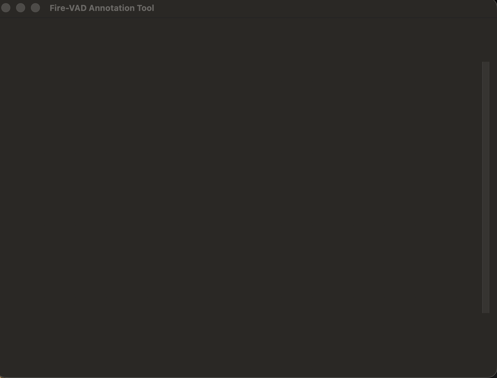

# Fire-VAD Annotation Tool

A desktop tool for annotating videos of the fire-VAD dataset (RGB and thermal/IR
camera). In one window, the annotator marks the frame where each new segment starts
and writes the four caption fields for every segment.



Works on Windows, macOS and Linux.

## Requirements

- Python 3.9 or newer with **Tk 8.6+** (the `tkinter` that ships with Python)
- numpy and Pillow (listed in `requirements.txt`)

| OS | Notes |
|---|---|
| Windows | The [python.org](https://www.python.org/downloads/windows/) installer includes Tk by default (keep *tcl/tk and IDLE* checked). |
| macOS | Apple's bundled `/usr/bin/python3` has Tk 8.5, which shows a blank window. Install Python from [python.org](https://www.python.org/downloads/macos/) or run `brew install python-tk@3.13`. |
| Linux | Also install the Tk package: `sudo apt install python3-tk` (Ubuntu/Debian) or `sudo dnf install python3-tkinter` (Fedora). |

## Installation

```bash
git clone https://github.com/Antunovic/firevad-annotation-tool.git
cd firevad-annotation-tool
pip install -r requirements.txt
```

Or download the ZIP (green **Code** button → **Download ZIP**), extract it and run
the same `pip` command in the extracted folder.

On Ubuntu 23.04 and newer, the system Python refuses `pip install`
("externally-managed environment"). Use a virtual environment there:

```bash
python3 -m venv .venv
source .venv/bin/activate
pip install -r requirements.txt
```

## Dataset

The videos are not part of this repository. Get `test_VAD.zip` (about 3 GB, Google
Drive link from the project coordinator), extract it and either:

- put the `test_VAD` folder **next to** this repository folder — the tool finds it
  there automatically (folders added by extracting, such as `test_VAD/test_VAD`,
  are fine too), or
- extract it anywhere and select the folder in the tool with
  **Change dataset folder…**.

## Running

```bash
python annotate_gui.py
```

On the first run you are asked for your **full name** — it identifies all your
annotation files, so always type it the same way. Annotations are stored locally
in the tool folder and never modify the dataset:

```
annotations/<your_name>/environment_<X>/<Y>.json   # one file per video
annotator_config.json                              # saved name and dataset location
```

## Annotating

1. Select a scene, press **Open scene**. Three synchronized panels open:
   **RGB**, **IR – relative** (contrast stretched per frame, shows structure) and
   **IR – absolute** (fixed temperature scale — type the range or press
   **Video range**). Hovering the mouse over an IR panel shows the exact
   temperature in °C.
2. Pause at the frame where a new segment starts and press **B**. A new segment
   starts when something appears or disappears, or when a person changes their
   action. Segments are consecutive and cover the whole video.
3. For each segment write four short captions **in English**: RGB initial state,
   RGB dynamics, IR initial state, IR dynamics. Preset buttons insert standard
   sentences for common cases ("No changes", "No temperature differences", …).
4. Save with **Ctrl+S** (macOS: **Cmd+S**). Unfinished work can be resumed later.
5. **Export all my annotations** writes
   `annotations/<your_name>/combined_export.json` — send that file to the
   coordinator.

The complete annotation guidelines are built into the tool: **Help**,
**Boundary instructions…** and **Caption instructions…**.

| Key | Action |
|---|---|
| Space | play / pause |
| ← / → | one frame back / forward |
| ↑ / ↓ | 10 frames back / forward |
| Home / End | first / last frame |
| B | a new segment starts at the current frame |
| Delete | remove the start boundary of the selected segment |
| F1 | help |

## Troubleshooting

| Problem | Fix |
|---|---|
| Blank (white) window on a Mac | Apple's Python has Tk 8.5. Install Python from python.org (or `brew install python-tk@3.13`) and run the tool with it. |
| `No fire-VAD videos were found` | Extract `test_VAD.zip` and select the folder with **Change dataset folder…**. |
| `externally-managed-environment` (Linux) | Use a virtual environment — see Installation. |
| `No module named '_tkinter'` (Linux) | `sudo apt install python3-tk` |
| `No module named 'numpy'` or `'PIL'` | `pip install -r requirements.txt` |
| Anything else | Send the coordinator a screenshot of the terminal output. |

## Development

`python annotate_gui.py --selftest` runs a headless self-check of the logic and
the dataset, and exits with a status code.

---

## Brzi vodič (HR)

1. Instalacija: Python 3.9+ s Tk 8.6+ (na Macu **ne** Appleov `python3` nego Python
   s [python.org](https://www.python.org/downloads/macos/) ili
   `brew install python-tk@3.13`; na Linuxu i `sudo apt install python3-tk`), zatim
   `pip install -r requirements.txt`.
2. Pokretanje: `python annotate_gui.py`. Pri prvom pokretanju upiši svoje **puno
   ime** — njime su označene sve tvoje anotacije.
3. Mapu `test_VAD` s videozapisima stavi pokraj alata (alat je sam nađe) ili je
   odaberi gumbom **Change dataset folder…**.
4. Odaberi scenu i klikni **Open scene**. Na frameu u kojem počinje novi segment
   pritisni **B** (novi segment = nešto se pojavi ili nestane sa scene ili osoba
   promijeni radnju). Za svaki segment napiši 4 kratka opisa **na engleskom**:
   početno stanje scene, radnje i promjene (RGB), početno stanje u IR, dinamika u
   IR. Piši objektivno, bez riječi tipa *slightly*/*slowly*/*rapidly*. Spremi s
   **Ctrl+S** / **Cmd+S**.
5. Na kraju klikni **Export all my annotations** i pošalji datoteku
   `combined_export.json` koordinatoru.
